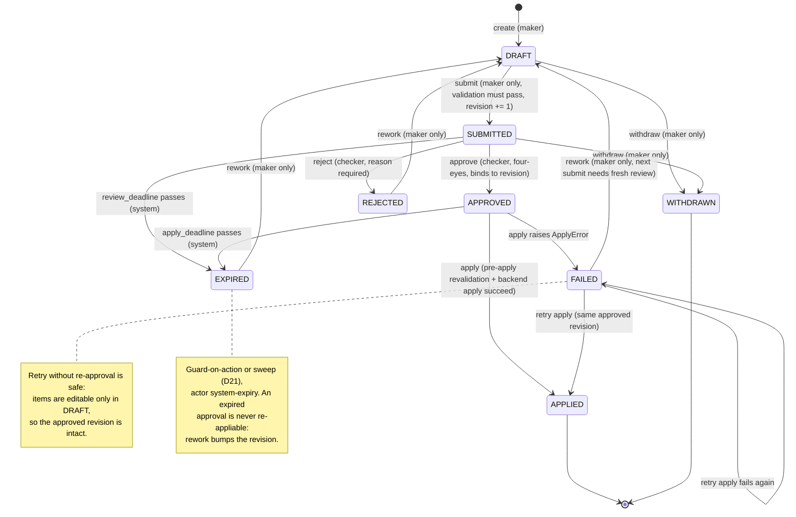
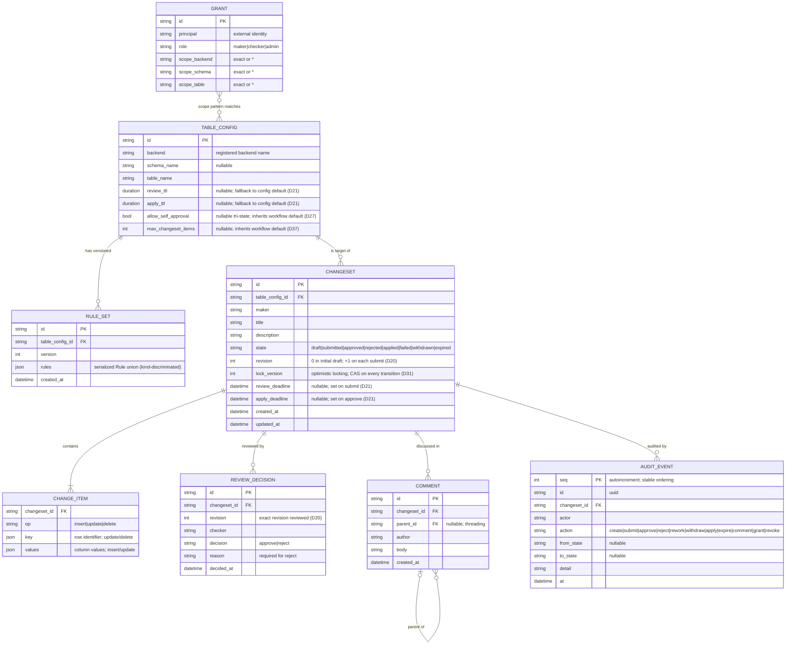

# bizkit — System Specification

> **This document is the source of truth for bizkit's design.** It exists so
> that a fresh session (or contributor) with no prior context can reproduce
> the same design and the same code decisions. When this specification
> changes, `CLAUDE.md`, the agent definitions in `.claude/agents/`, and the
> skills in `.claude/skills/` MUST be updated in the same change so their
> descriptions reflect the current spec (see §14 Maintenance Protocol).

## 1. Purpose

bizkit ("Business Configuration Toolkit") manages configuration data that
lives in database tables across seven technologies — Oracle, MSSQL, MySQL,
PostgreSQL, Percona, Snowflake, Databricks. Changes to that data go through
a **maker-checker workflow** with **per-table/per-target role-based access
control**, **threaded commenting**, **validation**, and a **full audit
trail**. Configuration tables are only ever written when an approved
changeset is applied.

Interfaces: Python library (`import bizkit`), CLI (`bizkit`, click), REST
API (FastAPI on :8091), React web UI (Vite build served by the API; the
built bundle ships in the wheel — end users need no Node).

## 2. Decision Log

Numbered, ADR-style. A decision stands until superseded by a later entry.

| # | Decision | Rationale |
|---|----------|-----------|
| D1 | Workflow state (changesets, approvals, comments, audit, grants) lives in a **separate bizkit-owned store**, never in target databases. Default `sqlite:///bizkit.db` (dev), PostgreSQL recommended for production. | Snowflake/Databricks are poor OLTP targets; one central store gives a single uniform audit trail and zero schema pollution across 7 heterogeneous targets. |
| D2 | The store and all backends use **sync SQLAlchemy 2.0**. FastAPI bridges via threadpool (plain `def` routes). Never introduce the async engine. | Snowflake/Databricks dialects are sync-only; a split async/sync story is worse than a uniform sync tier. |
| D3 | Target DB access via **SQLAlchemy 2.0 dialects as optional extras**; drivers lazy-imported. `import bizkit` must succeed with zero drivers installed; missing driver raises `BackendNotInstalledError` naming `pip install 'bizkit[<extra>]'`. | Users install only what they need; core stays lightweight. |
| D4 | Percona **rides the MySQL dialect** (`mysql+pymysql://`, extra `bizkit[mysql]`). No separate adapter; the integration matrix uses a Percona container image to prove compatibility. | Percona is wire-compatible with MySQL. |
| D5 | **Roles are explicit and rights are scoped per table/target.** Authorization is a domain port (`AccessPolicy`) with pluggable adapters: internal (grants table in the workflow store) or external IAM (group-mapping first; remote decision engines like OPA later). Selection is config-driven. | The user requires per-table checker rights, deployable both standalone and inside an enterprise IAM landscape. |
| D6 | **Authentication is always external.** bizkit never stores or verifies credentials; it receives an identity (CLI flag, API auth middleware) and decides entitlements only. | Keeps bizkit out of the credential business; works with any SSO/IdP. |
| D7 | The `AccessPolicy` port is **decision-style** (`is_allowed(actor, action, table) -> bool`), not role-enumeration-style. | External IAMs can always answer yes/no; they often cannot enumerate roles per table. |
| D8 | The **four-eyes rule (maker ≠ checker) is a hard domain invariant** enforced in `domain/approval.py`. No access policy adapter, role, or admin flag can override it. | The core control of maker-checker; must not depend on policy configuration. |
| D9 | **Every state transition goes through `Changeset.transition()`** driven by the `ALLOWED_TRANSITIONS` table, invoked only by `WorkflowService`. Status is never mutated via repository updates or raw SQL. | Single source of truth for the lifecycle; makes illegal states unrepresentable. |
| D10 | **Every state transition writes exactly one `AuditEvent` in the same store transaction.** Audit is never best-effort or after-commit. Audit events are immutable (frozen models, append-only log). | An audit trail that can diverge from state is not an audit trail. |
| D11 | **Validation rules are declarative, serializable pydantic models** (discriminated union on `kind`), never code/callables/eval. Failures are structured `ValidationIssue`s, never bare strings/exceptions. | Rule sets must round-trip through JSON, be storable per table, and be safe. |
| D12 | **Validation runs at submit AND again immediately before apply.** | Target state may drift between approval and apply. |
| D13 | Cross-table validation reads targets **read-only, through the `TargetBackend` port only**. | Preserves the "no writes outside apply" guarantee. |
| D14 | Layering (dependencies point left only): `domain` ← `store`/`backends`/`access` ← `services` ← `api`/`cli`. `domain` imports only stdlib + pydantic. | DDD; keeps the model pure and testable without I/O. |
| D15 | No global state; configuration via injected `BizkitConfig`. Custom exceptions rooted at `BizkitError`; never bare `except:`. Strict typing (mypy strict), Google docstrings, ruff. | Project conventions. |
| D16 | Tooling: **uv**, src layout, `py.typed`, `uv_build` backend, Python ≥3.13. Tests with pytest; unit tests never need a real database; integration tests behind markers. | Project conventions. |
| D17 | Schema for the store is created via `metadata.create_all` for now; **Alembic migrations are deferred** until the schema stabilizes. | Scaffold-stage simplicity. |
| D18 | License: GPL-3.0-only. Package/distribution name: `bizkit`. | Repo ships the GPLv3 text. |
| D19 | The workflow store keeps a **registry of configuration tables** (`bizkit_table_configs`) with **versioned rule sets** (`bizkit_rule_sets`). In the domain, changesets still carry `TableRef` as a value object; the store resolves it against the registry. Grants scope-match against registered tables by pattern. | Rule sets and access scopes need a durable anchor per table; a registry gives validation and authorization one place to attach to. |
| D20 | **Rework loop with revisions** (supersedes the earlier resubmit-as-new-changeset rule): `REJECTED → DRAFT` and `FAILED → DRAFT` return the changeset to the maker for adjustment. Change items are editable **only in DRAFT**; each `submit` increments a `revision` counter; approvals, rejections, and validation reports bind to `(changeset id, revision)` so an edit can never inherit a prior approval. Transient apply failures may be **retried from FAILED** without re-approval (the approved revision is provably unchanged). Terminal states: APPLIED, WITHDRAWN. The planned `supersedes` field is dropped. | Keeps checker feedback and the comment thread on one changeset; revisioning preserves exact-content auditability; retry avoids needless re-review when content hasn't changed. |
| D21 | **Expiry with review and apply windows.** `SUBMITTED` expires if not reviewed by `review_deadline`; `APPROVED` expires if not applied by `apply_deadline`. Deadlines are snapshotted at transition time from per-table TTLs in the table registry (`review_ttl`, `apply_ttl`), falling back to `BizkitConfig` defaults; unset means no expiry. `EXPIRED → DRAFT` (rework, maker only) — an expired approval can never be re-applied as-is because resubmission bumps the revision. Enforcement is **guard-on-action** (every WorkflowService operation checks deadlines first and materializes the expiry instead of acting on an overdue changeset) plus an **explicit sweep** (`bizkit expire` CLI, cron-able; optional periodic task in `bizkit serve`). Expiry transitions are audited with actor `system:expiry`. DRAFTs never expire — they are the maker's workspace. | Unreviewed submissions and stale approvals are both real risks (approval staleness is a standard maker-checker control); guard-on-action guarantees enforcement without a daemon, the sweep gives timely audit/notification. |
| D22 | **File-first configuration** (refines D19): table configs, rule sets, and internal grants load from a declarative **workspace config file** (YAML/JSON, `--config` / `BIZKIT_CONFIG`) at startup — config-as-code, reviewed via git PRs. They sit behind ports (`TableRegistry`, `AccessPolicy`), so store-backed adapters (`bizkit_table_configs`, `bizkit_rule_sets`, `bizkit_grants` + grants admin API/CLI) remain an **optional** alternative for deployments needing runtime administration. Under file config, rule-set binding uses a **content fingerprint** (hash recorded on validation reports and approvals, mappable back to a git commit); a `config_loaded` audit event records the active config fingerprint. Reload = restart or SIGHUP re-read. | Config is slow-changing and environment-defining; git review of entitlement/rule changes is a stronger control than admin endpoints, and environments stay reproducible. Operational state (changesets, comments, audit) stays in the store. |
| D23 | **The workspace config is versioned and schema-validated.** Every workspace file declares a required integer `version` (current: `1`). The file is parsed into a pydantic `WorkspaceFile` model, which is also the generator of the published **JSON Schema** (`bizkit config schema`); `bizkit config validate` lints a file and prints its fingerprint without starting anything. Loader policy: unknown or missing `version` → hard error (`ConfigError`); superseded versions are migrated in-loader where feasible or rejected with a clear upgrade message; any breaking schema change bumps `version` and gets a decision-log entry here. Unknown keys are rejected (pydantic `extra="forbid"`) so typos can't silently disable a grant or rule. (Store schema versioning is separate and stays deferred to Alembic, D17.) | A file that grants approval rights must fail fast and loudly on drift between file format and bizkit release; generated JSON Schema gives editors autocomplete/validation for free. |
| D24 | **Frontend stays a Vite + React SPA served by FastAPI; Next.js evaluated and rejected.** bizkit ships as a single Python wheel (`pip install bizkit && bizkit serve`) with the built SPA in `api/static/` — no Node at runtime. Next.js's differentiators (SSR, server components, API routes) require a production Node server (a second runtime), and its static-export mode disables those differentiators, reducing it to a heavier SPA toolchain. The UI is an authenticated internal dashboard (no SEO/SSR need) over a REST API that must exist anyway for CLI/library consumers. Within the SPA: TanStack Query for server state (refetch-on-transition, cache invalidation, optimistic updates), React Router for client routing. Revisit only if the UI becomes a standalone public product. | Single-runtime deployment is a core product property; the workload is the canonical SPA case; a Node BFF would duplicate the FastAPI surface. |
| D25 | **Principal-less entitlements are supported — but only via trusted claims** (clarifies D5/D6). With the `groups` provider, bizkit config holds no principals: a trusted upstream (IdP token, SSO middleware, reverse proxy) asserts the caller's roles/groups and bizkit maps claim → role + scope. Principal-bearing grants remain the model for the `file`/`store` providers where bizkit is the entitlement source. Regardless of provider, the **principal identity itself is always required** — four-eyes compares principals, audit records actors, `maker` is stamped per changeset. **Role/group claims used for enforcement must never be client-supplied**: the SPA may use roles for UX only; authorization reads claims from the verified server-side channel. Granularity caveat: a flat role claim can only map to a broad scope — per-table rights need scope-encoded IdP groups or principal grants. | Lets IAM-centric shops keep entitlements in the IdP with zero bizkit config duplication, without weakening four-eyes, audit, or opening client-forgeable roles. |
| D26 | **Deployment-level self-approval opt-out** (refines D8): `workflow.allow_self_approval: bool` in the workspace config, default `false`. When `true`, `approve` permits checker == maker; the `ReviewDecision` still records the checker, the audit event is flagged `self-approved` in `detail`, and the UI badges it — the trail never pretends a second person existed. The flag is **global deployment posture only**: never per-request, per-table, or per-role, and no API/runtime mechanism can toggle it (the flag change itself is git-reviewed under D22). All other controls — validation at submit and pre-apply, revision binding, expiry, scoped `approve` rights — remain fully enforced. Intended for solo teams and dev/sandbox deployments. Break-glass emergencies are explicitly **not** solved this way; use an on-call checker rota or emergency approver group. | Absolute four-eyes pushes solo teams into rubber-stamping or second accounts, which fakes the audit trail; an explicit, git-reviewed, conspicuously-audited opt-out is more honest. |
| D27 | **Per-table self-approval override** (refines D26): `TableConfig.allow_self_approval: bool \| None` — `None` inherits the global `workflow.allow_self_approval`; `true`/`false` overrides per table, in either direction (loosen one sandbox table in a strict deployment, or pin a critical table strict in a loose dev deployment). Effective setting = table override if set, else global. Still config-file-only (git-reviewed, D22), never runtime-toggleable, and every self-approval is audit-flagged regardless of which level permitted it. `bizkit config validate` and the `config_loaded` audit event report the **effective posture** — every table where self-approval is live — so reviewers never have to merge flags mentally. | Mixed-criticality deployments are the norm; a single global posture either drags everything loose or forces rubber-stamping on low-risk tables. Tri-state inheritance keeps the common case (inherit) declarative and the exceptions explicit. |
| D28 | **Multi-role users see the union of their grants; no UI role switcher.** There is no "active role" concept anywhere: enforcement is per-action (`is_allowed(actor, action, table)`), and the UI shows everything the combined grants allow. Capacity confusion is solved by **contextual messaging** ("you are the maker — another checker must review this") and queue filters (to-review / mine), not modes. Rationale for rejecting a switcher: bizkit's separation-of-duties control (four-eyes, D8) is identity-based, so a switcher adds no guarantee, only mode-error friction — and making it non-cosmetic would require threading an active-role session concept through the API and every `AccessPolicy` adapter. Organizations needing activation/elevation semantics do it upstream in the IdP (PIM-style); the `groups` provider (D25) inherits the resulting claim changes for free. | Union matches the enforcement model exactly; modes create "wrong hat" support burden without adding any control bizkit doesn't already enforce server-side. |
| D29 | **The store requires logical, not physical, separation** (clarifies D1). The workflow store may share a database instance with a target, provided: (1) it lives in its **own database/schema**, never inside a schema bizkit governs as a target; (2) it uses **separate least-privilege credentials** — the store user has no rights on target tables and the target backend user none on the store schema (two URLs even on one host); (3) the engine is **OLTP-suitable** — never Snowflake/Databricks. Known trade-off to accept consciously: co-location couples backup/restore lifecycles, so a point-in-time restore of the instance rewinds the audit trail together with application data — high-compliance deployments should prefer physical separation. Officially supported store engines: SQLite (dev), PostgreSQL (recommended prod); MySQL/MSSQL/Oracle best-effort (plain SQLAlchemy + JSON columns) until demand justifies adding them to the tested matrix. | Forcing a separate instance is unnecessary ops burden for shops with a managed Postgres/Oracle estate; the actual controls are schema and credential isolation, which co-location preserves — while the audit-restore coupling is real and belongs in the operator's risk decision, not hidden. |
| D30 | **Secret indirection in the workspace file.** URL/credential fields support `${ENV_VAR}` placeholders resolved at load time; a literal password in the file makes `bizkit config validate` fail. The config fingerprint (D22) is computed over the **raw unresolved text**, so secrets never influence or appear in audit — the fingerprint identifies the file; the environment is deployment context. Secret-manager URI schemes are a future adapter on the same resolution hook. | The workspace file is git-reviewed by design (D22); without indirection that means credentials in git — an immediate enterprise disqualifier. |
| D31 | **Concurrency and idempotency.** Changeset rows carry a store-level `lock_version` for optimistic locking; every `WorkflowService` transition is compare-and-set on (state, lock_version) — under a race, the first writer wins and the loser gets `ConcurrencyError` (new exception), never a double transition or duplicate audit event (exactly-once audit follows from same-transaction append + CAS). Retrying an already-effected transition is a clean conflict, not silent success. This also makes multi-replica deployments safe: N `bizkit serve` instances and concurrent `bizkit expire` sweeps race benignly. | Two checkers approving from two browsers is the normal case, not the edge case; audit integrity under races must be structural, not lucky. |
| D32 | **Observability.** Structured JSON logging with correlation fields (`changeset_id`, `actor`, `action`, `request_id`); liveness `/api/health` and readiness `/api/ready` (store reachable + workspace config loaded) stay **unversioned**; metrics go through a pluggable in-process hook (counters/gauges such as pending reviews, overdue changesets, applies by outcome) with a no-op default — a Prometheus adapter is a later optional extra (dependency rule applies). | A governance tool's ops signals (what's stuck, what's overdue) are the product; logging correlation is what makes incident forensics match the audit trail. |
| D33 | **API versioning from day one**: all business endpoints live under `/api/v1`; DTOs version with the path; breaking changes bump to `/api/v2` with a deprecation window. Health/readiness endpoints are unversioned infrastructure (D32). | The CLI, library, SPA, and application teams' integrations all consume this surface; versioning retrofitted later is itself a breaking change. |
| D34 | **Store migrations are a pre-GA gate** (refines D17): `metadata.create_all` is dev-only; before any release that promises an upgrade path, the store moves to Alembic migrations, and every store-schema change thereafter ships a migration. Workspace-config versioning (D23) remains a separate track. | Application teams will not accept "recreate the database" for a store holding their audit trail. |
| D35 | **Audit retention and archival.** The audit trail is append-only structurally: bizkit exposes no update/delete path for audit events, and hardened deployments revoke UPDATE/DELETE on `bizkit_audit_events` at the DB-grant level. bizkit never purges automatically; archival is an explicit operator flow — `bizkit audit export` (portable JSON) followed by an explicit age-gated purge command that itself writes an audit event. | Regulated audit retention (often years) outlives application data; automatic cleanup of an audit trail is a compliance bug, not a feature. |
| D36 | **Bulk change import (CSV) is in scope** (promoted from roadmap). Import populates **DRAFT changesets only** — a drafting convenience, never a control bypass; submit/validation/review/apply are unchanged. Two modes: `append` (explicit `_op` column: insert\|update\|delete, plus key/value columns) and `diff` (file = desired end state; bizkit reads current target rows read-only via the `TargetBackend` port (D13) and computes the insert/update/delete delta). CSV via stdlib (UTF-8, BOM-tolerant); cells type-coerced against the table's canonical `ColumnSpec`; **all-or-nothing**: any coercion error adds nothing and returns a structured `ImportReport` (row, column, message). Guard: `workflow.max_changeset_items` (default 10 000) keeps changesets reviewable. Requires the maker's `submit` right on the table; audited with verb `import` recording source filename, content hash, and row count. Implemented in `services/importer.py`, `bizkit import` CLI, `POST /api/v1/changesets/{id}/items/import`, and a draft-view upload in the SPA. The API accepts a **raw `text/csv` body** with `mode`/`filename` query params rather than multipart, avoiding the `python-multipart` dependency (multipart possible later with approval). Excel input (openpyxl) stays on the roadmap per the dependency rule. | Hand-entering hundreds of rows pushes teams back to raw SQL — the exact thing bizkit exists to prevent; diff mode turns "replace this table" into a reviewable changeset. |
| D37 | **Universal changeset size cap** (hardens D36's guard): the effective `max_changeset_items` (per-table tri-state override `int \| None` on `TableConfig`, inheriting `workflow.max_changeset_items`, default 10 000 — same inheritance pattern as D27) is enforced on **every** path that grows a changeset — manual item adds via API/CLI, CSV import, and diff-mode delta generation — and re-checked at submit. Exceeding it raises `ChangesetLimitError`; nothing is partially added. Scope statement: bizkit governs configuration data, not bulk data loading — million-row changes belong in ETL pipelines, and chunking them into many capped changesets does not make them reviewable and is explicitly not the intended workaround. | A changeset too large to read is a governance failure: the checker approves what they cannot review, reducing four-eyes to theater. Per-table override lets big reference tables raise the cap explicitly in git-reviewed config. |
| D38 | **READER role** (extends the D5 role model): `reader` grants exactly `{view}` on a scope. Readers browse table contents AND see the workflow around those tables (changesets, decisions, audit — transparency), but cannot comment, submit, or review; commenting stays between makers/checkers. `ROLE_ACTIONS` gains `reader → {view}`. View-scoped filtering of changeset/audit endpoints is enforced when real auth middleware lands; until then the dev deployment is open-view. | Config consumers (downstream systems' owners, auditors) need to see what the configuration is and what is about to change to it, without being able to touch it. |
| D39 | **Table content browsing and grid-based drafting.** The UI's primary surface is the table browser: clicking a table shows its current rows (via new `GET /api/v1/tables/{backend}/{schema}/{table}/rows`, backed by `TargetBackend.read_rows` — read-only per D13 — plus `introspect_table` for columns). Users with `submit` rights raise changesets **directly from the grid**: cell/row edits become `update` items, added rows `insert`, row deletions `delete`, all accumulating into a **draft basket** — one pending draft reviewed as a diff and saved/submitted as a single changeset (respecting the D37 cap). To make this real in dev/demo (and to be the first test vehicle for the backend contract), a **`sqlite` demo backend** joins the registry as a dev-only 8th backend (read path first; not an enterprise target, excluded from the D3 extras story — stdlib driver). | "Change this table" starts from seeing the table; grid-to-basket matches how config edits actually happen (a batch of related row changes = one reviewable changeset), and one-changeset-per-cell would spam checkers. |
| D40 | **UI specification is a governed document**: `UI_SPECIFICATION.md` at the repo root is the source of truth for information architecture, design tokens, screens, and role-based visibility — owned by the `ux-designer` agent and synced under the §14 protocol exactly like this file. Core IA decided there: professional enterprise shell with a **left sidebar** navigating Queue + tables grouped by target (filtered to the caller's `view` grants, compose affordance only with `submit`), top bar with identity and readiness. | UI decisions were accumulating in agent bodies and chat; a fresh session must be able to rebuild the same UI, which needs the same source-of-truth treatment as the system spec. |
| D41 | **A changeset targets exactly one table** (makes the implicit model explicit). Rationale: apply atomicity cannot honestly span targets (no 2PC across Oracle/Snowflake/Databricks — "APPLIED" would become ambiguous, corrupting D10/D31 guarantees); authorization is table-scoped (D5), and multi-table review would require every-table rights; per-table policy (TTLs D21, self-approval D27, caps D37) would need strictest-wins combination rules. Coordinated cross-table changes are addressed later by a **bundle/release** layer (roadmap §15): multiple single-table changesets linked by a bundle id, presented together for review, each approved by its own table's checkers and applied with its own target's semantics — coordination without pretending cross-database atomicity exists. | Keeps APPLIED meaning exactly what it says, keeps the checker pool and policy resolution per-table crisp, and routes the real need (review related changes together) to an honest mechanism. |
| D42 | **Pluggable `AuthProvider` port for authentication** (concretizes D6; supplies the "trusted upstream" D25 assumed). A new domain port, `AuthProvider` (`domain/ports.py`), sits alongside `AccessPolicy` — authentication (who someone is) stays a separate port from authorization (what they can do); every adapter below only ever produces an `Identity` (`principal`, `display_name`, `email: str \| None`, `groups: list[str]`), which then flows into the **existing, unchanged** `GroupMappingAccessPolicy` (D5/D25). Selection is config-driven — `auth.provider: "none" \| "oidc" \| "ldap" \| "token"` — same pattern as `access.provider` and backend selection. Adapters: **`none`** — today's trusted-header dev behavior, but now **structurally gated**: `create_app()` refuses to start with `provider: none` unless `auth.allow_insecure_dev_mode: true` is also set, so it can never be an accidental production config. **`oidc`** — generic OIDC/OAuth2 (Authorization Code + PKCE), one adapter covering any compliant IdP (PingOne, PingFederate, Okta, Azure AD, Auth0, Keycloak) via config alone (issuer, client id/secret via D30 secret indirection, redirect URI, scopes, group-claim name) — never vendor-specific code; backend-mediated (the API handles redirect/callback/token exchange and holds the session, the SPA never touches a token), making D25's "claims from the verified server-side channel" structural rather than conventional. **`ldap`** — an LDAP/AD bind: submitted credentials verify against a directory and are discarded immediately, never persisted — the actual answer to "basic auth" without bizkit ever owning a password, still consistent with D6. **`token`** — a static bearer token for CI/service accounts, matched against a configured `{token_hash: principal}` set (hash stored, never plaintext); machine-only, no session, no human login path. `saml` is deliberately **not** a v1 adapter (flagged in the port shape so it can slot in later) — build only on concrete demand, since it's a heavier surface than OIDC for the same outcome. Session-storage mechanism (stateless signed cookie vs. a server-side session table in the workflow store) and a first-class `bizkit login` CLI subcommand are open implementation questions, not decided here. | Applies the ports-and-adapters pattern already used for `TargetBackend` and `AccessPolicy` to authentication instead of inventing a new mechanism, and gives real deployments (PingOne SSO now, others later) an actual verification path instead of the fully-trusted header the scaffold ships with today — while keeping every mode consistent with D6 (OIDC/LDAP delegate verification externally; `token` never involves a human credential at all). Rejected: a bizkit-owned username/password store (directly violates D6, and is an open-ended security-maintenance burden for a config-governance tool); simultaneous multi-provider login (no real need yet — revisit only if a genuine multi-IdP/multi-tenant case appears); MFA implemented inside bizkit (always delegated to the IdP, or flagged as a gap of `ldap` mode). |
| D43 | **Reader is the single view-only/transparency persona; `view` deliberately spans data *and* audit (clarifies D38).** The `view` action grants both browsing current table content AND seeing the governance history around that table — its changesets, review decisions, and audit trail. There is intentionally **no separate `auditor` role and no separate `view_audit`/`audit` action**: an auditor is provisioned as a `reader` on the relevant scope, and every `view`-gated surface (rows, changesets tab, changeset detail, and audit trail) rides on that one action. Considered and rejected: splitting `view` into `view` (data) + `view_audit` (governance history) with an `auditor = {view_audit}` bundle to support a compliance auditor who verifies process integrity (four-eyes honored, self-approvals flagged, deadlines met) *without* seeing the underlying config values — rejected because, for the target deployments, the auditor and the data-reader are the same look-but-don't-touch persona, and splitting `view` would ripple through every view-gated endpoint, the sidebar table-tree visibility, and audit-scope filtering for no current benefit. **Revisit condition**: a real deployment must grant process-audit visibility while denying the (sensitive) config data values — at which point split the **action** (granularity lives in the `Action` enum, not the `Role` set, per D5), keeping `reader = {view, view_audit}` and adding `auditor = {view_audit}`; the role stays a thin bundle over the new action. | Roles are thin bundles of actions (D5) and `is_allowed` checks actions, not roles — an `auditor` role with no distinct underlying action would be cosmetic. Premature granularity is cost without benefit; recording the rejection and its revisit condition keeps a future session from re-deriving the same analysis. |
| D44 | **Apply milestone: how an approved changeset reaches the target** (implements D9/D12/D13's write path; the `NotImplementedError` stubs §13 flagged are now gone). **One generic DML implementation** lives in `BaseBackend` on SQLAlchemy Core against the reflected table, inherited by all seven dialects (plus the D39 `sqlite` demo backend) — SQLAlchemy compiles per-dialect and binds parameters, so no adapter hand-writes SQL; a dialect overrides only where semantics genuinely differ. `dry_run()` and `apply()` share one code path differing solely in commit-vs-rollback, so a rehearsal exercises the target's real constraints and then leaves nothing behind. Both are **all-or-nothing** in a single transaction, and an UPDATE/DELETE whose key matches anything other than exactly one row is raised as `ApplyError` naming drift rather than absorbed. The backend independently re-checks that the changeset is APPROVED (or FAILED, being retried per D20) — defense in depth behind `WorkflowService`. **`WorkflowService.apply(changeset_id, actor)`** orders the guards: expiry first (D21 guard-on-action), then `Action.APPLY` authorization (checker in the default `ROLE_ACTIONS`, *not* maker), then a state check, then **revalidation** (D12), then the backend handoff. It returns a new **`ApplyResult(changeset, report, error)`** rather than only a `Changeset`: a target-side or validation failure is a *result*, not an exception, because the FAILED transition and its audit event must be committed — an exception would unwind them. Pre-conditions that change nothing (no rights, wrong state, lapsed deadline) still raise. Exactly one audit event per attempt: verb `apply` on success, `apply_failed` on failure with the reason in `detail`. **Rule evaluation is now real** (the D11 schemas gain semantics): `BaseRule.evaluate(item, context)` takes a `RuleContext(table, rows_for)`, where `rows_for` is a lazy per-referenced-table read-only fetch — so a rule set with no cross-table rules never opens a target connection, and a `CrossTableRule` may reference a table in a *different* backend. Two conventions bind every rule: a DELETE carries no values so value-shaped rules skip it, and a column absent from an UPDATE is *unchanged rather than null* (absence is only meaningful on INSERT). `CrossFieldRule.predicate` resolves against a **closed registry** (`domain/predicates.py`) — an unregistered id is a validation *issue*, never an import of behaviour, keeping D11's data-not-code property; a `CrossTableRule` with no `rows_for` reports rather than passing, since failing open would let an unvalidated row reach apply. **Validation now runs at submit as well as pre-apply**, closing the D12 hard constraint: submit raises `ValidationFailedError` (carrying the structured report) without transitioning, so invalid work never reaches a checker's queue; the pre-apply run is what catches drift between approval and apply. Consequence for demo data: an *invalid* changeset can no longer be submitted at all, so the seeded REJECTED example is now a valid change declined on business grounds — rejection is human judgement, not a stand-in for validation. **Delivery**: `POST /api/v1/changesets/{id}/apply` returning `ApplyResultOut` — a target refusal is a **200 with `ok: false`** and the changeset in FAILED (the attempt is a recorded transition the client must see), while 403/409 stay for refusals that change nothing; `POST …/validate` implemented (was 501) returning `ValidationReportOut`; `bizkit apply <id> --actor <who> [--dry-run]` and `bizkit validate <id>`; and an Apply / Retry apply action in the changeset detail view behind a two-click confirmation naming the target table. `TableActionsOut` gains an **`apply`** field so the UI stops inferring the affordance from `approve` — affordance only, fail-closed, enforcement still server-side (D25). | A maker-checker tool whose approvals never reach the database is a review queue, not a configuration toolkit; APPROVED was a dead end in every delivery layer. One inherited DML implementation avoids seven hand-written SQL generators drifting apart, and sharing it between dry-run and apply is what makes a rehearsal trustworthy. Returning a result instead of throwing is what lets FAILED and its audit event survive the same transaction that produced them. Rejected: per-dialect hand-written DML (drift, injection surface, seven times the tests); treating a target refusal as an HTTP error (loses the recorded transition the audit trail needs); and allowing makers to apply their own approved changesets (four-eyes covers approval; a maker who can also apply narrows the control to one pair of hands at the moment it matters most). |

## 3. Domain Model

All ids are `uuid.uuid4().hex` strings. All timestamps are UTC
(`datetime.now(UTC)`). All enums are `StrEnum` with lowercase values.

### 3.1 Changeset (aggregate root) — `domain/changeset.py`

A changeset targets **exactly one table** (D41); coordinated cross-table
changes are a future bundle-of-changesets concept (§15), never one
changeset spanning tables.

- `Changeset`: `id`, `table: TableRef`, `maker: str`, `title`,
  `description`, `items: list[ChangeItem]`, `state: ChangesetState`,
  `revision: int` (starts at 0 in DRAFT; incremented by each submit),
  `review_deadline: datetime | None` (snapshotted on submit; D21),
  `apply_deadline: datetime | None` (snapshotted on approve; D21),
  `created_at`, `updated_at`.
- `ChangeItem`: `op: ChangeOp` (`insert`/`update`/`delete`),
  `key: dict | None` (row identifier; required for update/delete),
  `values: dict | None` (required for insert/update).
- `ChangesetState`: `draft`, `submitted`, `approved`, `rejected`,
  `applied`, `failed`, `withdrawn`, `expired`.

State machine (`ALLOWED_TRANSITIONS`, the single source of truth):



Textual form:

```
DRAFT     → SUBMITTED | WITHDRAWN
SUBMITTED → APPROVED | REJECTED | WITHDRAWN | EXPIRED
APPROVED  → APPLIED | FAILED | EXPIRED
REJECTED  → DRAFT (rework)
FAILED    → DRAFT (rework) | APPLIED | FAILED (retry)
EXPIRED   → DRAFT (rework)
APPLIED, WITHDRAWN → (terminal)
```

Rework semantics (D20): change items are editable only in DRAFT; each
submit increments `revision`; approvals, rejections, and validation
reports bind to `(changeset id, revision)`, so reworked content always
requires a fresh review. Retry from FAILED re-applies the already-approved
revision. `Changeset.transition()` raises `ChangesetStateError` on illegal
transitions and refreshes `updated_at`.

Expiry semantics (D21): submit snapshots `review_deadline`, approve
snapshots `apply_deadline` (per-table TTLs from the registry, falling
back to `BizkitConfig` defaults; unset = no expiry). Every
`WorkflowService` operation checks deadlines first: acting on an overdue
changeset materializes the `EXPIRED` transition instead of performing the
action. `bizkit expire` sweeps proactively. DRAFTs never expire.

### 3.2 Access control — `domain/access.py` (to be created)

- `Role`: `maker`, `checker`, `reader`, `admin`. Readers hold `view`
  only (D38) — `reader` is the single view-only/transparency persona and
  is also the **auditor** persona; there is deliberately no separate
  `auditor` role (D43). Admin manages grants; admin never bypasses
  four-eyes (D8).
- `Action`: `submit`, `approve`, `reject`, `apply`, `comment`, `view`.
  `view` deliberately spans both current table data AND the governance
  history around the table (its changesets, review decisions, and audit
  trail) — one action, not split into data-view and audit-view (D43;
  revisit condition recorded there).
- `Scope`: `(backend, schema, table)` pattern; each segment is an exact
  string or `*` (matches any). Example: `snowflake/*/fx_rates`,
  `oracle/finance/*`.
- `Grant`: `(principal, role, scope)`.
- Default role→action mapping: `maker` → submit, comment, view;
  `checker` → approve, reject, apply, comment, view; `reader` → view
  (D38; covers data + audit transparency, D43); `admin` → grant
  management + view.

Port (in `domain/ports.py`):

```python
class AccessPolicy(Protocol):
    def is_allowed(self, actor: str, action: Action, table: TableRef) -> bool: ...
```

Adapters (D5, D22):
- **File (default)**: `workspace/access.py` — `FileAccessPolicy` over
  grants declared in the workspace config file; changes are reviewed via
  git, and the active config fingerprint is audited on load.
- **Store (optional)**: `store/access.py` — `bizkit_grants` table +
  `StoreAccessPolicy`, for deployments needing runtime administration.
  Grant changes are audited.
- **External (group-mapping)**: `access/groups.py` —
  `GroupMappingAccessPolicy`; auth middleware supplies the caller's group
  names; `AccessConfig.group_mappings` maps group → role + scope.
- **External (remote decision)**: future adapter calling OPA/Keycloak-style
  endpoints; same port.

Selection: `BizkitConfig.access.provider: "file" | "store" | "groups"`
and a `policy_from_config()` factory; `WorkflowService` receives the
policy via DI and cannot tell adapters apart.

Role sources (D25): with `groups`, entitlements are principal-less —
claims asserted by trusted middleware map to role + scope, and bizkit
config holds no principals. The principal identity is still always
required (four-eyes, audit, maker stamping). Claims used for enforcement
must come from the verified server-side channel, never from the SPA;
frontend-known roles are for UX affordances only.

### 3.3 Enforcement points

| Operation | Authorization (via `AccessPolicy`) | Additional invariants |
|---|---|---|
| create/submit | `submit` on the table | submitter becomes/must be the maker; submit re-checks the effective `max_changeset_items` cap (D37) |
| approve / reject | `approve` / `reject` on the table | four-eyes (D8), unless the **effective** self-approval setting permits (table override, else global — D26/D27); self-approvals are audited as such; rejection requires a reason |
| apply | `apply` on the table | changeset must be `approved` (first apply) or `failed` (retry of the same approved revision); pre-apply revalidation must pass (D12) |
| rework | — | maker only (identity rule); only from `rejected`, `failed`, or `expired`; next submit increments the revision and requires fresh review |
| expire | — | system-triggered (guard-on-action or `bizkit expire` sweep); actor `system:expiry`; only from `submitted` (review deadline) or `approved` (apply deadline) |
| withdraw | — | maker only (identity rule, not a grant) |
| comment | `comment` on the table | — |
| import | `submit` on the table | DRAFT changesets only; all-or-nothing with `ImportReport`; capped by `max_changeset_items`; audited with file hash (D36) |
| view | `view` on the table | one action covers table data *and* the table's changesets, decisions, and audit trail — auditors are readers (D43) |

### 3.4 Approval — `domain/approval.py`

`Decision` (`approve`/`reject`), `ReviewDecision` (`changeset_id`,
`revision` — the exact revision reviewed (D20), `checker`, `decision`,
`reason`, `decided_at`), `ensure_checker_is_not_maker(changeset, checker,
allow_self_approval=False)` raising `ApprovalError` — the flag is threaded
in from `WorkflowConfig` by the service (D26); the domain function stays
pure and defaults to strict.

### 3.5 Comments — `domain/comment.py`

`Comment`: `id`, `changeset_id`, `author`, `body`,
`parent_id: str | None` (threading), `created_at`.

### 3.6 Audit — `domain/audit.py`

`AuditEvent` (frozen): `id`, `changeset_id`, `actor`, `action` (verbs:
`create`, `submit`, `approve`, `reject`, `rework`, `withdraw`, `apply`,
`expire`, `comment`, `import`, `grant`, `revoke`), `from_state`,
`to_state`, `detail`, `at`. Expiry events use actor `system:expiry` and record the
lapsed deadline in `detail`.

### 3.7 Validation — `domain/validation.py`

- `Severity`: `error` (blocking) / `warning` (advisory).
- `ValidationIssue`: `rule_id`, `table`, `row_key`, `column`, `severity`,
  `message`.
- `ValidationReport`: `issues`; `ok` ⇔ no error-severity issues; a
  non-ok report blocks submit/apply (`ValidationFailedError`).
- Rules (discriminated union `Rule`, discriminator `kind`), all extending
  `BaseRule` (`rule_id`, `description`, `evaluate(item) -> list[ValidationIssue]`):
  - `TypeRule` (`type`): `column`, `expected_type` (canonical).
  - `ConstraintRule` (`constraint`): `column`, `not_null`, `min_value`,
    `max_value`, `allowed_values`.
  - `CrossFieldRule` (`cross_field`): `columns`, `predicate` (id of a
    **registered** predicate — never code).
  - `CrossTableRule` (`cross_table`): `ref_table`, `local_columns`,
    `ref_columns`, `must_exist`.
- Rule sets are versioned data attached to a table's configuration, not
  code baked into services. Under the default file-first config (D22) the
  version is a **content fingerprint** recorded on validation reports and
  approvals; under the optional store-backed registry it is the
  `RULE_SET.version` row.

### 3.8 Tables — `domain/table.py`

`TableRef` (`backend`, `schema_name`, `table`, `qualified_name()`),
`ColumnSpec` (`name`, `type` canonical, `nullable`, `primary_key`).

`TableRegistry` port (in `domain/ports.py`): resolves a `TableRef` to its
registered configuration — TTLs, rule set and its fingerprint/version.
Adapters (D22): `FileTableRegistry` (workspace config file, default) and
`StoreTableRegistry` (optional, store-backed).

### 3.9 Exceptions — `exceptions.py`

`BizkitError` (root) ← `ChangesetStateError`, `ApprovalError`,
`ValidationFailedError`, `UnknownBackendError`,
`BackendNotInstalledError`, `ApplyError`, `StoreError`. (To be added
with their modules: `AccessDeniedError` with `domain/access.py`,
`ConfigError` with `workspace/loader.py` (D23), `ConcurrencyError` with
the store's optimistic locking (D31), `ChangesetLimitError` with the
size cap (D37), `AuthenticationError` with `domain/identity.py` (D42 —
raised by an `AuthProvider` adapter when credentials/tokens/sessions
fail to verify; distinct from `AccessDeniedError`, which is an
authorization decision on an already-verified identity).)

### 3.10 Entity-relationship view (workflow store)

Logical model of everything the workflow store persists to support
maker-checker, commenting, validation, audit, and scoped access control.
Target databases are deliberately absent — bizkit stores nothing there (D1).



Notes:
- **`TABLE_CONFIG`, `RULE_SET`, and `GRANT` are logical entities, not
  necessarily tables** (D22): their default system of record is the
  workspace config file, and the store tables materialize only when the
  optional store-backed adapters are enabled. The rest of the diagram
  (changesets, decisions, comments, audit) is operational state and always
  lives in the store.
- In the **domain**, the changeset carries `TableRef` as a value object and
  `ChangeItem`s as an embedded list; the diagram is the logical/persistence
  view. At scaffold stage the store keeps the aggregate payload as a JSON
  column with indexed scalar columns (§4) — `CHANGE_ITEM` need not be its
  own physical table until querying demands it.
- `GRANT` has no foreign key to `TABLE_CONFIG`: scoping is by pattern match
  (`*` wildcards per segment), evaluated by the `AccessPolicy` adapter.
- With an external IAM (D5), entitlements live outside bizkit entirely —
  neither file nor store holds grants.
- Users are not an entity (D6): principals are external identities;
  `maker`, `checker`, `author`, `actor`, `principal` are identity strings.

### 3.11 Authentication — `domain/identity.py` (to be created, D42)

Separate from §3.2 Access control by design: this port answers "who is
this?"; `AccessPolicy` still answers "what can they do?". Nothing in
this section changes `AccessPolicy` or its adapters.

- `Identity`: `principal`, `display_name`, `email: str | None`,
  `groups: list[str]`. This is the *only* thing every `AuthProvider`
  adapter produces, and the *only* thing `GroupMappingAccessPolicy`
  (§3.2) consumes from it — the two ports connect through this one
  value object and nothing richer.

Port (in `domain/ports.py`):

```python
class AuthProvider(Protocol):
    def login_url(self, state: str, redirect_to: str) -> str | None: ...
    def handle_callback(self, request: CallbackRequest) -> Identity: ...
    def authenticate(self, credentials: Credentials) -> Identity: ...
```

Adapters (`auth/`, D42), selected via `BizkitConfig.auth.provider`:
- **`none`** (`auth/none.py`) — trusted `X-Bizkit-User`/`X-Bizkit-Groups`
  headers, unchanged from today's scaffold behavior. Only reachable when
  `auth.allow_insecure_dev_mode: true` is also set; `create_app()` raises
  `ConfigError` at startup otherwise. Dev/demo only, never production.
- **`oidc`** (`auth/oidc.py`) — generic OIDC/OAuth2, Authorization Code +
  PKCE, backend-mediated (API-held session, never an SPA-held token).
  One adapter for any compliant IdP (PingOne, PingFederate, Okta, Azure
  AD, Auth0, Keycloak) — differences are config values, never code.
- **`ldap`** (`auth/ldap.py`) — binds submitted credentials against a
  directory; the bind is the entire verification; credentials are
  discarded immediately after, never persisted. Group memberships come
  from a subsequent LDAP search, mapped the same way OIDC group claims
  are.
- **`token`** (`auth/token.py`) — static bearer token matched against a
  configured `{token_hash: principal}` set (config stores the hash,
  never the plaintext). Machine-only: CI/service accounts, no session,
  no human login surface.
- **`saml`** — deliberately not built for v1; the port shape
  accommodates it later. Build only when a concrete deployment needs a
  SAML-only IdP (roadmap §15 candidate, not yet a decision).

Every adapter's `Identity.groups` feeds the existing
`GroupMappingAccessPolicy` unchanged (§3.2) — D42 only adds the
authentication side of the system; the authorization side (grants,
scopes, roles) is untouched.

Open questions, not yet decided (tracked in §15 until resolved):
session-storage mechanism (stateless signed cookie vs. a server-side
session table in the workflow store — the latter gives real immediate
revocation, consistent with bizkit already owning a DB for workflow
state); whether a first-class `bizkit login` CLI subcommand is worth
adding versus per-mode flags/env vars.

## 4. Module Layout

```
src/bizkit/
├── __init__.py, __main__.py, py.typed
├── exceptions.py, config.py
├── domain/          # pure model: changeset, approval, comment, audit,
│   │                #   validation, table, access, identity, ports
├── store/           # sync SQLAlchemy persistence of workflow state:
│   │                #   engine.py, models.py, repositories.py; optional
│   │                #   store-backed config adapters (access.py, registry.py)
├── workspace/       # file-first config adapters (D22): loader.py
│   │                #   (YAML/JSON workspace file), registry.py
│   │                #   (FileTableRegistry), access.py (FileAccessPolicy)
├── backends/        # base.py, registry.py, typemap.py,
│   │                #   oracle|mssql|mysql|postgres|snowflake|databricks.py
├── access/          # external IAM adapters (groups.py, later opa.py …)
├── auth/            # pluggable AuthProvider adapters (D42): none.py,
│   │                #   oidc.py, ldap.py, token.py (saml.py future)
├── services/        # workflow.py, validation.py, importer.py, comments.py
├── api/             # app.py (create_app factory), schemas.py (DTOs),
│   │                #   routes/ (health, changesets, comments, validation,
│   │                #   tables), static/ (built SPA)
└── cli/main.py      # click group `bizkit`
frontend/            # Vite + React + TS; build.outDir → src/bizkit/api/static
tests/               # mirrors src; unit tests DB-free; integration marked
```

Store tables (always): `bizkit_changesets`, `bizkit_comments`,
`bizkit_audit_events`, `bizkit_review_decisions`. Only with the optional
store-backed config adapters (D22): `bizkit_table_configs`,
`bizkit_rule_sets`, `bizkit_grants`. See ER diagram, §3.10. The store may
share an instance with a target under the D29 conditions (own
database/schema, separate least-privilege credentials, OLTP engine);
separation is logical, not necessarily physical.
Scaffold persistence strategy: domain payload as JSON column + indexed
scalar columns (id, state, maker, changeset_id); audit rows get an
autoincrement `seq` for stable ordering.

## 5. Backends

Contract (`backends/base.py`): `BaseBackend` with class vars `name`,
`extra`, `driver_module`; lazy `engine` property (driver check on first
use); `introspect_table()`, `read_rows()` (read-only), `dry_run()`
(must leave the target unchanged — transactional rollback where supported,
client-side simulation where not), `apply()` (one transaction where the
dialect supports it; where not, write-then-verify reporting partial
application via `ApplyError`).

**The write path is one inherited implementation (D44)**, not seven: DML
is built with SQLAlchemy Core against the reflected `Table`, so each
dialect gets correctly compiled statements and bound parameters without
hand-written SQL. `dry_run()` and `apply()` call the same `_run()` and
differ only in commit-vs-rollback — a rehearsal therefore exercises the
target's real constraints. Shared invariants:

- **All-or-nothing**: every item executes in one transaction; the first
  failure aborts the changeset (`ApplyError` naming the item position).
- **Exactly one row**: an update/delete whose key matches 0 or >1 rows is
  drift since approval, raised rather than absorbed.
- **Column check**: item keys/values naming columns the target does not
  have fail before execution (catches misattribution).
- **State re-check**: only APPROVED (or FAILED being retried, D20) may
  reach a target — defense in depth behind `WorkflowService`.

A dialect overrides only where semantics differ: **Databricks** has no
multi-statement transactions, so it cannot honour the rollback and must
override `dry_run` (write-then-verify per the table below); **Snowflake**
declares but does not enforce constraints, so a clean rehearsal there
proves less than on Postgres.

| Backend | Extra | Driver | URL prefix | Key quirks |
|---|---|---|---|---|
| Oracle | `oracle` | oracledb | `oracle+oracledb://` | no transactional DDL; `''` ≡ NULL; uppercase identifier folding |
| MSSQL | `mssql` | pyodbc | `mssql+pyodbc://` | DSN/driver strings; IDENTITY insert rules |
| MySQL | `mysql` | pymysql | `mysql+pymysql://` | DDL implicit commit; utf8mb4 |
| Percona | `mysql` | pymysql | `mysql+pymysql://` | = MySQL dialect (D4) |
| PostgreSQL | `postgres` | psycopg | `postgresql+psycopg://` | transactional DDL; reference implementation |
| Snowflake | `snowflake` | snowflake-sqlalchemy | `snowflake://` | constraints declared but NOT enforced → dry-run simulates client-side |
| Databricks | `databricks` | databricks-sqlalchemy | `databricks://` | Delta; no multi-statement transactions → apply is write-then-verify |

Registry: name → `"module:Class"` lazy map; unknown name raises
`UnknownBackendError`. A dev-only `sqlite` demo backend (stdlib driver,
no extra) joins the registry per D39 as the demo/test vehicle for the
backend contract — it is not an enterprise target. Type map (`typemap.py`): canonical types
`string, integer, decimal, boolean, date, timestamp` ↔ dialect types,
bidirectional, covered by tests for all seven backends.

## 6. Services

- `WorkflowService(changesets, audit, access)` — the ONLY place
  transitions happen. Operations: `create`, `submit`, `approve`, `reject`,
  `rework`, `withdraw`, `apply`, `expire`; each checks §3.3 authorization,
  performs the transition via the domain, persists, and appends the audit
  event in the same transaction (repositories share one session; the
  caller/unit of work commits). Every transition is compare-and-set on
  (state, `lock_version`) — racing writers lose with `ConcurrencyError`,
  and audit events are exactly-once (D31).
- `ValidationService` — runs rule sets over changesets; orchestrates
  backend `dry_run`. Rule *semantics* here; per-dialect dry-run
  *mechanics* in backends. It assembles the `RuleContext(table,
  rows_for)` (D44): `rows_for` resolves the backend **lazily per
  referenced table**, so a rule set without cross-table rules never
  opens a target connection and a `CrossTableRule` may point at a table
  in a different backend. Validation is invoked at **submit** (blocking,
  `ValidationFailedError` with the report, no transition) and **again
  immediately before apply** (D12) — the second run is what catches
  target drift between approval and apply.
- `WorkflowService.apply` (D44) returns an **`ApplyResult(changeset,
  report, error)`** rather than a bare `Changeset`. A validation or
  target-side failure is a *result*: the changeset moves to FAILED and
  that transition plus its `apply_failed` audit event must be committed,
  which an exception would unwind. Pre-conditions that change nothing —
  missing `apply` right, wrong state, lapsed deadline — still raise.
- `ImportService` (`services/importer.py`, D36) — bulk CSV → change items
  in a DRAFT changeset; `append` and `diff` modes; canonical type
  coercion; all-or-nothing with structured `ImportReport`; enforces
  `workflow.max_changeset_items`; audited (`import`).
- `CommentService` — add/list threaded comments (authorized via `comment`).

## 7. API

FastAPI app from `create_app(config)` factory; sync (`def`) routes so the
sync store runs in the threadpool (D2). Business endpoints are versioned
under `/api/v1` (D33); health/readiness are unversioned (D32). Identity
resolution goes through the configured `AuthProvider` (D42): a request
dependency validates whatever session/token the active adapter uses and
produces the request's `Identity`, replacing the old blanket-trusted
`_identity()`. The `none` adapter keeps today's trusted-header behavior
(`X-Bizkit-User`, `X-Bizkit-Groups`) but only when
`auth.allow_insecure_dev_mode: true` — `create_app()` refuses to start
otherwise. Structured JSON logging with correlation fields and a
pluggable metrics hook per D32.

Endpoints (scaffold → target): `GET /api/health` (liveness),
`GET /api/ready` (store reachable + config loaded);
`GET/POST /api/v1/changesets`; `GET /api/v1/changesets/{id}`;
`POST /api/v1/changesets/{id}/submit|approve|reject|rework|withdraw|apply`;
`GET/POST /api/v1/changesets/{id}/comments`;
`POST /api/v1/changesets/{id}/validate`;
`POST /api/v1/changesets/{id}/items/import` (multipart CSV, `mode=append|diff`, D36);
`GET /api/v1/tables`;
`GET /api/v1/tables/{backend}/{schema}/{table}/rows` and `…/columns`
(read-only target browsing for the table browser, D39; requires `view`);
`GET /api/v1/me` (current `Identity`, driving the SPA's display-only
topbar under any non-`none` provider); auth routes (D42, present only
for modes that need them): `GET /api/v1/auth/login` (redirect to the
IdP; `oidc` only), `GET /api/v1/auth/callback` (`oidc` token exchange +
session creation), `POST /api/v1/auth/login` (`ldap` — accepts
`{username, password}`, performs the bind, creates a session),
`POST /api/v1/auth/logout` (any session-based mode); grants admin:
`GET/POST/DELETE /api/v1/grants` (only with the
store-backed access adapter, D22). DTOs in `api/schemas.py` are separate from domain
models. SPA served from `api/static/` when present.
`bizkit serve` may run an optional periodic expiry sweep (D21); guard-on-
action makes the sweep a timeliness optimization, not a correctness
requirement.

`…/apply` is the one route that reaches a target, and it only delegates to
`WorkflowService.apply`. Its `ApplyResultOut` (D44) deliberately splits
two kinds of "no": a **target refusal or failed pre-apply validation is a
200 with `ok: false`**, the changeset in FAILED, and `report`/`error`
carrying the reason — the attempt is a recorded transition the client must
be able to show. Refusals that change nothing stay HTTP errors (403 no
`apply` right, 409 wrong state). `…/validate` returns
`ValidationReportOut` and transitions nothing, letting a maker see the
report before submitting. `TableActionsOut` carries an `apply` field so
the UI never infers that affordance from `approve` (D25: affordance only,
fail-closed).

## 8. CLI

`bizkit` (click group; `--store-url`, env `BIZKIT_STORE_URL`; identity via
`--user`, env `BIZKIT_USER` — **only meaningful under `auth.provider:
none`**, gated the same way as the API's trusted-header mode, D42).
Other providers get their own CLI path: `bizkit login` performs the
`oidc` device-code grant or prompts once for `ldap` credentials (bound,
then discarded) and caches a short-lived local session; `token` mode
reads a bearer token from `--token`/`BIZKIT_TOKEN`. `init-store [--seed-sample]`, `list`,
`show`, `submit`, `review` (approve/reject),
`apply <id> --actor <who> [--dry-run]` (D44 — `--dry-run` rehearses
against the target and rolls back, printing what would happen and
changing no workflow state), `validate <id>` (report only, exit 1 on
blocking issues),
`comment`, `expire` (sweep overdue changesets; cron-able, D21),
`import <file> --table <t> [--mode append|diff] [--changeset ID]`
(bulk CSV into a draft changeset; D36),
`audit export` / `audit purge` (age-gated, itself audited; D35),
`grant`/`revoke`/`grants` (store-backed access adapter only, D22),
`config validate` (lint a workspace file, print its fingerprint and the
effective self-approval posture per D27) and
`config schema` (emit the workspace JSON Schema) (D23),
`serve [--host --port --reload]`. Global options also include
`--config` (workspace config file path, env `BIZKIT_CONFIG`).
`--seed-sample` creates a demo SQLite target (`sample_target.db`), a demo
config table, one pending changeset, and sample grants (a maker and a
checker) so authorization is exercised out of the box. The seed is
**internally consistent with apply (D44)**: rows a pending changeset
inserts are deliberately absent from the target (inserting an existing key
would trip the primary key), rows a pending update targets are present,
and the REJECTED example is a *valid* change declined on business grounds
— since validation now runs at submit, an invalid changeset cannot reach a
checker at all.

## 9. Configuration

`BizkitConfig` (pydantic, injected — no globals): `store_url`,
`targets: dict[str, TargetConfig]` (`backend`, `url`),
`auth: AuthConfig` (D42 — `provider: "none" | "oidc" | "ldap" | "token"`,
default `"none"`; `allow_insecure_dev_mode: bool = False`, required
alongside `provider: none` or `bizkit config validate`/`create_app()`
fail; provider-specific sub-config as a discriminated union:
`oidc: {issuer, client_id, client_secret, redirect_uri, scopes,
group_claim}`, `ldap: {server_uri, base_dn, user_dn_template,
group_search_base}`, `token: {tokens: [{principal, token_hash}]}`),
`access: AccessConfig` (`provider: "file" | "store" | "groups"`,
`group_mappings`), `workflow: WorkflowConfig`
(`default_review_ttl: timedelta | None`,
`default_apply_ttl: timedelta | None` — per-table TTLs override these;
`None` at both levels means no expiry, D21;
`allow_self_approval: bool = False` — deployment-level four-eyes opt-out,
D26; `max_changeset_items: int = 10_000` — universal reviewability cap on
every item-adding path and at submit, with per-table tri-state override,
D36/D37). Factory `load_config()`; API/CLI construct it at the edge.

**Workspace config file** (D22, D23): the default source for table
configs, rule sets, and grants. Passed via `--config` / `BIZKIT_CONFIG`;
JSON via stdlib, YAML via `pyyaml` (core dependency — flagged for user
approval per the dependency rule). The file is versioned and
schema-validated (D23): `version` is required, the pydantic
`WorkspaceFile` model rejects unknown keys, and `bizkit config schema`
emits the JSON Schema for editor tooling (YAML users can pin it with a
`# yaml-language-server: $schema=…` comment). On load, bizkit
fingerprints the file content and audits `config_loaded`. Shape (all
`BizkitConfig` fields plus the config-as-code sections):

```yaml
version: 1                  # required; workspace schema version (D23)
store_url: ${BIZKIT_STORE_URL}          # secret indirection (D30) —
targets:                                #   literal passwords fail validate
  fx_prod: { backend: snowflake, url: "${FX_PROD_URL}" }
auth:
  provider: none             # none | oidc | ldap | token (D42)
  allow_insecure_dev_mode: true   # required for provider: none to start
  # oidc: { issuer: "https://auth.pingone.com/<env-id>/as",
  #         client_id: bizkit, client_secret: "${BIZKIT_OIDC_SECRET}",
  #         redirect_uri: "https://bizkit.internal/api/v1/auth/callback",
  #         scopes: [openid, profile, email, groups], group_claim: groups }
access:
  provider: file            # file | store | groups
workflow:
  default_review_ttl: P7D   # ISO-8601 durations
  default_apply_ttl: P2D
  allow_self_approval: false  # D26; set true only for solo/dev deployments
tables:
  - { backend: fx_prod, schema: MART, table: FX_RATES,
      review_ttl: P3D,
      allow_self_approval: false,   # optional tri-state; omit to inherit (D27)
      rules: [ { kind: constraint, rule_id: rate-positive,
                 column: rate, min_value: 0 } ] }
grants:
  - { principal: alice, role: maker,   scope: "fx_prod/*/FX_RATES" }
  - { principal: bob,   role: checker, scope: "fx_prod/*/*" }
```

## 10. Frontend

Vite + React + TypeScript in `frontend/` (SPA by design — see D24; no
SSR framework). Server state via TanStack Query; client routing via
React Router. Dev server proxies `/api` → :8091; `npm run build` outputs
to `src/bizkit/api/static/` (committed, so the wheel ships a working UI).

The rows grid is built on TanStack Table (headless; client-side
features at config scale, manual server paging beyond the 500-row fetch
cap — see UI_SPECIFICATION.md §4.1). Grid editing requires a primary
key: keyless tables are insert-only because update/delete change items
must carry a row key (§3.1).

Multi-role UX (D28): the UI presents the **union** of the caller's
grants — no role switcher, no active-role state. Capacity is explained
in context ("you are the maker — another checker must review") and the
changeset queue offers to-review / mine filters.

Identity display (D42): the topbar's identity control renders the dev
`UserPicker` only when `GET /api/v1/me` reports `auth.provider: none`;
every other provider renders a "Sign in" redirect (`oidc`) or a login
form (`ldap`) instead, and once authenticated the topbar is
**display-only**, sourced from `/api/v1/me` — no client-editable
identity outside dev mode. This makes UI_SPECIFICATION.md §3's existing
"production: display-only, from auth" line real rather than aspirational.
The SPA never holds a token under `oidc`/`ldap` (session cookie, D42) —
`api.ts` drops the `X-Bizkit-User` header entirely once a real provider
is configured.

The full information architecture, design tokens, screens (sidebar
shell, table browser with draft basket, queue, detail/review), and
role-based visibility matrix live in **`UI_SPECIFICATION.md`** (D40),
owned by the `ux-designer` agent and synced under §14. Views (target): changeset list, changeset
detail with diff-style item view, comment thread, approve/reject actions,
validation report display.

Apply in the UI (D44): the changeset detail view offers **Apply to
target** on an APPROVED changeset and **Retry apply** on a FAILED one,
gated on the server-reported `apply` affordance (fail-closed while the
tables query is unresolved). Because it is the workflow's one
irreversible step it takes **two clicks**, and the confirmation names the
target table. A not-ok result renders the reason in place — the target's
complaint and/or the pre-apply validation issues — with copy explaining
that this can differ from the submit-time report because the target may
have changed since approval.

## 11. Testing Strategy

- Fast suite (`uv run pytest`): no real databases ever — in-memory SQLite
  for the store, mocks/fakes for backends and policies.
- Required smoke coverage: full transition matrix (every (state, target)
  pair, legal and illegal), four-eyes rule (strict and D26/D27 effective
  settings), authorization allow/deny per operation, store round-trips,
  registry unknown/uninstalled errors, API health + changeset list (httpx
  ASGI), CLI entry (`--help`, `init-store`, `list`).
- Concurrency coverage (D31): two racing transitions on one changeset —
  exactly one wins, the loser gets `ConcurrencyError`, exactly one audit
  event exists; concurrent expiry sweeps are benign.
- Importer coverage (D36): append and diff modes against fixture tables;
  coercion failure → nothing added + structured report; non-DRAFT target
  rejected; `max_changeset_items` guard; import audit event carries the
  file hash.
- Size-cap coverage (D37): cap enforced on manual add, import, and diff
  generation; re-checked at submit; per-table override wins over global;
  `ChangesetLimitError` raised, nothing partially added.
- Validation coverage (D12/D44): each rule kind's semantics, including
  the two shared conventions (a DELETE is skipped by value-shaped rules;
  a column absent from an UPDATE is unchanged, not null); an unregistered
  `CrossFieldRule` predicate is an issue rather than a crash; a
  `CrossTableRule` without `rows_for` reports rather than passes; rules
  still round-trip through JSON (D11); submit blocks on a blocking issue
  without transitioning, and the raised error carries the report.
- Apply coverage (D44): backend `dry_run` leaves the target byte-identical
  while surfacing the same error `apply` would hit; `apply` is
  all-or-nothing; a 0-or-many row match is reported as drift; unknown
  columns are refused; a non-approved changeset is refused at the backend
  too. Orchestration: `apply` right required (a maker is refused), wrong
  state refused, an overdue approval expires instead of applying,
  revalidation runs against the *current* rule set/target (the
  clean-at-submit-then-blocked-at-apply case is tested explicitly), a
  target failure lands in FAILED with the reason audited, FAILED retries
  to APPLIED, APPLIED is terminal, and exactly one audit event exists per
  attempt. End-to-end over HTTP and through `bizkit apply` (incl.
  `--dry-run`) against a real sqlite target file.
- Frontend suite (`cd frontend && npm test`): **vitest + React Testing
  Library + jsdom**, run alongside `tsc -b`. Covers the queue predicates,
  the draft basket's one-table scoping (UI_SPECIFICATION.md §4.1 — the
  keep-draft/discard prompt and the guarantee that items can never be
  filed against the table merely on screen), and the Apply action
  (fail-closed affordance, two-click confirmation, rendering a not-ok
  result's reason). Navigation in tests goes through `MemoryRouter` and
  real links: a data router builds a `Request` whose `AbortSignal` jsdom
  does not satisfy.
- Auth coverage (D42): fast suite uses fake/mock `AuthProvider` adapters
  — no real IdP or directory needed; `none` refuses to start without
  `allow_insecure_dev_mode` (`ConfigError`); an `Identity`'s `groups`
  correctly drives `GroupMappingAccessPolicy` end-to-end via a fake
  identity; `oidc`/`ldap` adapters get contract tests against
  stubbed/recorded provider responses (JWKS fixtures, a fake LDAP
  bind), with any real-IdP integration test gated behind its own marker
  and auto-skipped without live credentials, same posture as the DB
  backend matrix.
- Integration: markers `integration`, `db_postgres`, `db_mysql`,
  `db_mssql`, `db_oracle`, `db_snowflake`, `db_databricks`, `slow`
  (registered in pyproject). Containers where possible (Percona image for
  MySQL); Snowflake/Databricks gated on `BIZKIT_TEST_SNOWFLAKE_URL` /
  `BIZKIT_TEST_DATABRICKS_URL`, auto-skip otherwise. `testcontainers` is
  added to dev deps only when first needed, with user approval.

## 12. Dependencies

Core: `click>=8.1`, `pydantic>=2.0`, `sqlalchemy>=2.0`, `fastapi>=0.115`,
`uvicorn[standard]>=0.30`; plus `pyyaml>=6` for the YAML workspace config
(D22 — **not yet approved/added**; JSON workspace files need stdlib only).
Extras per §5. Dev: `pytest`, `pytest-asyncio`,
`httpx`, `ruff`, `mypy` (+ `pytest-cov` in the `dev` extra). Adding any
new library requires asking the user first.

Proposed for D42 (**not yet approved/added**): an OIDC client library
(e.g. `authlib` — async-friendly, handles Authorization Code + PKCE +
JWKS validation) for the `oidc` `AuthProvider` adapter, and an LDAP
client (e.g. `ldap3`) for the `ldap` adapter. Both `none` and `token`
adapters need no new dependency (stdlib `hmac`/`secrets` suffice for
token hashing).

## 13. Implementation Status

- ✅ Claude config: `CLAUDE.md`, agents (`workflow-engineer`,
  `db-dialect-specialist`, `validation-engineer`, `frontend-engineer`,
  `ux-designer`), skills (`add-backend`, `db-matrix-test`, `run-stack`,
  `record-decision`, `spec-conformance`, `release`).
- ✅ `UI_SPECIFICATION.md` (D40): personas, design tokens and semantic
  state colors, sidebar shell IA, table browser with grid-to-basket
  drafting (D39), queue/detail/actions definitions, role visibility
  matrix incl. reader (D38), interaction patterns, phasing P1–P3.
- ✅ Repo plumbing: `pyproject.toml`, `README.md`, `.gitignore`,
  `.python-version`, `CHANGELOG.md`, CI pipeline
  (`.github/workflows/ci.yml` enforcing the Definition of Done gates).
- ✅ `exceptions.py` (full hierarchy incl. `AccessDeniedError`,
  `ConcurrencyError`, `ConfigError`, `ChangesetLimitError`), `config.py`
  (Target/Access/Workflow/Bizkit configs incl. D26/D37 fields).
- ✅ `domain/` — current with the spec: state machine with rework loop
  and EXPIRED (D20/D21), `revision` + deadlines on `Changeset`,
  `access.py` (Role/Action/Scope/Grant, wildcard matching), approval
  with the D26/D27 flag, validation rule schemas (discriminated union),
  `table_config.py`, ports (incl. `AccessPolicy`, `TableRegistry`,
  `DecisionRepository`).
- ✅ `workspace/` — loader (version-gated, `extra="forbid"`, `${ENV_VAR}`
  indirection, fingerprint over raw text, literal-secret detection; JSON
  via stdlib, YAML if pyyaml present), `FileTableRegistry`,
  `FileAccessPolicy`.
- ✅ `store/` — engine/session factories, JSON-payload models, CAS
  repositories (`ConcurrencyError` on conflict, D31), append-only audit
  log, decision repository.
- ✅ `backends/` — base with lazy-driver discipline (D3), registry with
  `percona`→mysql alias (D4), bidirectional typemap for all seven, six
  dialect stubs with quirk docstrings. **Write path implemented (D44)**:
  one generic SQLAlchemy Core DML implementation in `BaseBackend`
  (`_reflect`/`_check_columns`/`_execute_item`/`_run`) inherited by every
  dialect — `dry_run` and `apply` differ only in commit-vs-rollback,
  all-or-nothing per changeset, exactly-one-row assertion on
  update/delete (drift → `ApplyError`), and an APPROVED/FAILED state
  re-check. `introspect_table`/`read_rows` are implemented on the
  `sqlite` demo backend (D39); the other six still raise
  `NotImplementedError` for those two read methods pending live-dialect
  work, so their write path is untested against real engines.
- ✅ `access/groups.py` — `GroupMappingAccessPolicy` (claims in via
  callback; API middleware wiring pending).
- ✅ `services/` — `WorkflowService` fully operational
  (create/submit/approve/reject/rework/withdraw/expire + sweep, with
  authorization, four-eyes incl. effective D26/D27 setting, revisions,
  deadline snapshots, guard-on-action expiry, D37 caps, exactly-one
  audit event per transition) **plus `apply` returning `ApplyResult`
  (D44): expiry guard → `Action.APPLY` authorization → state check →
  pre-apply revalidation → backend handoff, with `apply`/`apply_failed`
  as the one audit event per attempt**; `CommentService`;
  `ValidationService` **fully operational (D44)** — assembles the
  `RuleContext` with a lazy per-ref `rows_for`, and every rule kind
  (type/constraint/cross-field/cross-table) evaluates against the
  closed predicate registry in `domain/predicates.py`. Validation is
  wired into **both** submit (raises `ValidationFailedError` carrying
  the report, no transition) and pre-apply, closing D12;
  `ImportService` fully implemented (D36): CSV via stdlib (UTF-8-sig),
  canonical type coercion from backend introspection, append mode
  (optional `_op` column, insert default) and diff mode (desired end
  state vs `read_rows` → insert/update/delete delta), all-or-nothing
  with structured `ImportReport`, DRAFT-only + maker-only + submit-right
  enforcement, D37 cap, `import` audit event with sha256 + row/item
  counts; keyless tables insert-only, diff requires a PK. Wired through
  `POST …/items/import` (raw text/csv body), the `bizkit import` CLI
  (`--changeset` or `--table` creating a fresh draft), and an Import CSV
  dialog in the table browser with report rendering.
- ✅ `api/` — `create_app` factory; `/api/health` + `/api/ready`
  (fingerprint reported); dev identity via trusted `X-Bizkit-User`
  header (D6); `BizkitError`→HTTP mapping (403/404/409/422);
  `/api/v1`: `me`, `tables` (with per-caller affordances, D25/D28),
  changesets CRUD-lite (create incl. `submit_now`, list, detail with
  items), transitions (submit/approve/reject/rework/withdraw),
  comments (threaded GET/POST), decisions (with `self_approved` flag),
  audit trail, **`apply` returning `ApplyResultOut` (200 + `ok:false`
  for a target refusal, 403/409 for refusals that change nothing) and
  `validate` returning `ValidationReportOut` — both D44, replacing the
  501 placeholders**; `import` (D36); SPA mount. `TableActionsOut`
  carries an `apply` affordance (D44).
- ✅ `cli/` — `init-store [--seed-sample]` (writes sample workspace +
  target DB + pending changeset), `list`, `serve` (uvicorn factory,
  `--reload`), `expire`, `config validate` (fingerprint + effective
  self-approval posture + secret check), `config schema`,
  **`apply <id> --actor <who> [--dry-run]` and `validate <id>` (D44)**;
  explicit stubs remain for show/submit/review/comment.
- ✅ `tests/` — 292 passing (plus 30 frontend tests under vitest): full transition matrix, four-eyes strict +
  D26/D27 matrix, scope wildcards, authorization allow/deny, CAS
  conflict (one winner, clean `ConcurrencyError`), expiry guard +
  sweep, caps incl. per-table override, workspace loader
  (version/extra-forbid/env/fingerprint/secrets), registry + typemap
  matrix, API smoke (httpx ASGI), CLI smoke (seed → list → validate).
  D44 adds: rule-evaluation semantics per kind, backend dry_run/apply
  (atomicity, rollback, drift, unknown column, state guard), apply
  orchestration (rights, state, expiry, revalidation, retry, one audit
  event), apply/validate over HTTP against a real sqlite target, and
  `bizkit apply` incl. `--dry-run`.
  Gates: pytest, ruff check/format, mypy strict all clean; frontend
  `npm test` (vitest + React Testing Library) and `tsc -b` clean; wheel
  builds with `py.typed` + `api/static/`.
- ✅ `frontend/` — Vite + React 19 + TS SPA (D24/D28), full workflow
  frontend: dev identity picker (X-Bizkit-User; alice/bob/carol quick
  chips), changeset queue with all/to-review/mine filters (D28), tables
  page (per-caller role affordances, TTLs, self-approval posture, "New
  changeset"), draft-creation form (op/key/values item editor,
  save-draft or save-and-submit), detail view with change items,
  state-appropriate actions (submit/approve/reject-with-reason/rework/
  withdraw, four-eyes capacity messaging), review decisions with
  SELF-APPROVED badge, threaded comments with reply, and the audit
  trail. Builds into the committed `src/bizkit/api/static/` bundle.
  Seeder provides six changesets covering draft/submitted/approved/
  rejected/withdrawn/expired plus a comment thread.
- ✅ D38/D39/D40 UI milestone (UI_SPECIFICATION.md P1+P2): `reader` role
  in `domain/access.py`; `sqlite` demo backend with working
  introspect/read_rows; `…/columns` + `…/rows` endpoints with view
  enforcement and paging; `TableOut` carries the effective
  `max_changeset_items`; SPA rebuilt as the sidebar shell (Workbench
  queue with to-review count, tables grouped by target with ✎/👁
  affordances), table browser (rows grid with policy chips + changesets
  tab; read-only for readers) with grid-to-basket drafting (edit/insert/
  delete → basket bar → review slide-over with before→after diff and
  cap counter → save/submit), affordance-aware detail (review actions
  gated on approve rights, comment composer hidden for readers). UI
  polish pass: dark-slate collapsible sidebar (persisted preference),
  client-side search/sort/pagination in the rows grid, queue search,
  **Rules & policy tab** (effective policy + rule cards; `TableOut`
  exposes `rules`), rule dots on column headers. Seeder: 4 target tables
  with data, rules on three of them, reader `dave`, eight changesets
  incl. a multi-item batch and a self-approved one (holidays permits
  self-approval per D27) plus a 1,200-row `instruments` reference table
  that exercises the large-table server-paging mode. Sidebar is
  resizable (drag handle, persisted); tables render as bordered
  rounded-corner cards per UI_SPECIFICATION.md §2.1.
- ⬜ Pending milestones:
  `introspect_table`/`read_rows` for the 7 enterprise targets (the
  generic write path from D44 is inherited but exercised only against
  `sqlite` so far — no live-dialect integration run yet);
  store-backed config adapters (D22); structured logging/metrics (D32);
  Alembic (D34); `audit export/purge` (D35); CLI workflow commands
  (show/submit/review/comment currently stubs — the API/UI cover these
  flows).
- ✅ D44 apply milestone landed: backend DML, `WorkflowService.apply`,
  rule evaluation, validation at submit + pre-apply, `POST …/apply` and
  `POST …/validate`, `bizkit apply`/`bizkit validate`, and the UI
  Apply/Retry action.
- ⬜ **D42 Authentication — spec only, no code yet.** Today's
  `_identity()` (`api/app.py`) still trusts `X-Bizkit-User` unconditionally
  and `GroupMappingAccessPolicy` (`access/groups.py`) is still unwired —
  this is the divergence D42 exists to close. Pending: `domain/identity.py`
  (`Identity`, `AuthenticationError`) + `AuthProvider` port in
  `domain/ports.py`; `auth/` adapters (`none`, `oidc`, `ldap`, `token`;
  `saml` deferred); `AuthConfig` in `config.py` + workspace schema
  (`bizkit config validate` gate on `none` + `allow_insecure_dev_mode`);
  replacing `_identity()` with the configured-provider dependency;
  `/api/v1/auth/*` routes and wiring `create_app()` to branch on
  `config.access.provider` into `GroupMappingAccessPolicy` (the adapter
  itself needs no changes); `bizkit login` / `--token` CLI paths;
  frontend login screen + display-only topbar identity; the `authlib`/
  `ldap3` dependency approvals (§12).

## 14. Maintenance Protocol

1. **This file is the source of truth.** Design changes are recorded here
   first (append/supersede entries in the Decision Log §2 — do not silently
   rewrite history), then implemented.
2. **Whenever this specification changes, update in the same change:**
   `CLAUDE.md` (glossary, constraints, commands), every affected agent in
   `.claude/agents/` (frontmatter description AND body), and every
   affected skill in `.claude/skills/`, so they reflect the current spec.
   The `record-decision` skill is the executable checklist for this
   protocol — use it for every decision.
3. Code follows spec: if code and spec disagree, either fix the code or
   change the spec explicitly — never leave them divergent.
4. Keep §13 Implementation Status current so a fresh session knows what
   exists versus what is only specified.

## 15. Roadmap (direction agreed, design not yet done)

Listed so future sessions extend rather than reinvent; each item becomes
a D-entry when designed:

- **Notifications** — webhook-first (changeset submitted / approaching
  deadline / decided events POSTed to configured URLs); email/chat are
  consumers of webhooks, never core features.
- **Bundles/releases** (D41) — link multiple single-table changesets
  under a bundle id for coordinated review ("all must be approved");
  each changeset keeps its own checkers, policy, and apply semantics.
  No cross-database atomicity is promised, ever.
- **Remote-decision access adapter** (OPA/Keycloak-style) on the existing
  `AccessPolicy` port (D5).
- **SAML `AuthProvider` adapter** on the D42 port — only if a concrete
  deployment needs a SAML-only IdP; heavier surface than `oidc` for the
  same outcome.
- **Session-storage decision** for D42's `oidc`/`ldap` adapters:
  stateless signed cookie vs. a server-side session table in the
  workflow store (real immediate revocation vs. simplicity) — not yet
  decided.
- **`bizkit login` as a first-class CLI subcommand** vs. per-mode
  flags/env vars, for D42's `oidc` device-code and `ldap` bind flows.
- **Prometheus metrics adapter** on the D32 metrics hook (optional extra).
- **Secret-manager URI resolution** on the D30 indirection hook.
- **Excel import** (openpyxl) as an input format extension of D36 (CSV
  bulk import is in scope; see D36).
- **Store engine matrix expansion** beyond SQLite/Postgres (D29) on
  demand.
- **Read push-down** — pagination/filter/sort parameters on
  `TargetBackend.read_rows` so the table browser's search/sort work on
  large tables server-side (today the API paginates in-process and the
  grid caps client features at 500 rows).
- **`new-rule-type` skill** once the rule engine has its first real
  implementations.
